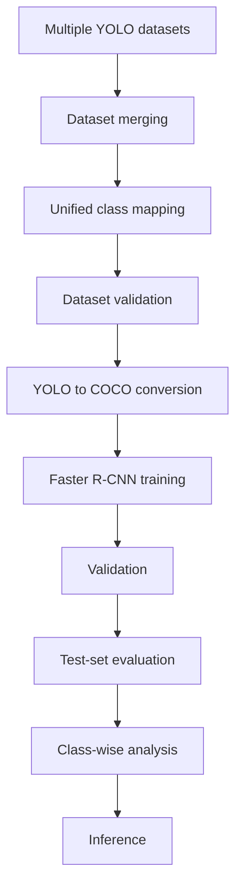

# Skin Lesion Detection

**Faster R-CNN ResNet50 FPN for 10-class lesion localization and classification**

From merged YOLO sources to COCO-format training, test-set evaluation, and class-wise recall.

[](https://www.python.org/)
[](https://pytorch.org/)
[](#model--performance)
[](#overview)
[](#model--performance)

The system finds a lesion with a bounding box and assigns one of ten disease labels. It started as a binary benign/malignant detector and was expanded into a unified 10-class pipeline.

Full engineering journey: open [`index.html`](index.html) in a browser.

---

## Overview

Skin-lesion images are not a single-label classification problem if the goal is to **show where** the model is looking. This repository trains a two-stage detector:

- **Localize** the lesion (bounding box)
- **Classify** it into one of 10 categories (plus background in the detector head)

Public Kaggle sources arrived with different folders, class ids, and YOLO layouts. Preprocessing merges those sources, remaps ids, validates image–label pairs, converts YOLO → COCO, then trains Faster R-CNN with torchvision.

---

## Pipeline



---

## Key Features

- Bounding-box detection plus 10-way lesion classification in one model
- Multi-source merge with a single class-id space
- Distribution checks before training (`scripts/check_distribution.py`)
- YOLO → COCO conversion for torchvision Faster R-CNN and `pycocotools`
- CUDA training (80 epochs) with a best checkpoint under `models/detector/`
- Test evaluation: COCO mAP and class-wise recall on unseen images
- Internal report in `index.html`

---

## Model & Performance

| | |
|---|---|
| Architecture | Faster R-CNN, ResNet50 FPN (`fasterrcnn_resnet50_fpn_v2`) |
| Head | Background + 10 lesion classes |
| Framework | PyTorch / Torchvision |
| Training | 80 epochs, CUDA |
| Checkpoint | `models/detector/faster_rcnn_multiclass_v2_best.pth` |

Test-set COCO metrics:

| Metric | Result |
|--------|--------|
| mAP@0.5 | **60.2%** |
| mAP@0.5:0.95 | **34.4%** |
| mAP@0.75 | **33.6%** |
| AR@100 | **48.6%** |

mAP@0.5 uses IoU ≥ 0.5. mAP@0.5:0.95 averages AP from 0.5 to 0.95 and is stricter on box quality. These scores measure detection (box + class), not image-level accuracy.

---

## Supported Classes

| # | Disease | Code |
|---|---------|------|
| 1 | Benign | `benign` |
| 2 | Malignant | `malignant` |
| 3 | Actinic Keratosis | `ak` |
| 4 | Basal Cell Carcinoma | `bcc` |
| 5 | Dermatofibroma | `dermatofibroma` |
| 6 | Melanoma | `melanoma` |
| 7 | Nevus | `nevus` |
| 8 | Pigmented Benign Keratosis | `pigmented_bk` |
| 9 | Squamous Cell Carcinoma | `scc` |
| 10 | Vascular | `vascular` |

---

## Dataset Pipeline

Sources under `data/raw/` are not a single dataset. The merge step copies image–label pairs into `data/multiclass/processed/{train,val,test}/`, rewrites YOLO `class_id` values onto the table above, and avoids filename collisions with a source prefix.

`scripts/check_distribution.py` is used after merge so a class is not silently dropped (this caught a `pigmented_bk : 0` mapping bug during development).

`src/preprocessing/convert_yolo_to_coco.py` writes `data/multiclass/annotations/{train,val,test}.json` for the detector loader.

Images, labels, and weights are **not** in git. See [`data/README.md`](data/README.md) and [`models/README.md`](models/README.md).

Expected layout after preprocessing:

```
data/
├── raw/
└── multiclass/
    ├── processed/
    │   ├── train/{images,labels}
    │   ├── val/{images,labels}
    │   └── test/{images,labels}
    └── annotations/
        ├── train.json
        ├── val.json
        └── test.json
```

---

## Getting Started

```bash
python -m venv .venv
```

Windows:

```powershell
.\.venv\Scripts\Activate.ps1
pip install -r requirements.txt
```

Put source datasets in `data/raw/`. After training, the best weights are expected at `models/detector/faster_rcnn_multiclass_v2_best.pth`.

Run detector scripts from `src/detector/` **or** put that folder on `PYTHONPATH` so `from dataset import SkinLesionDataset` resolves.

---

## Running the Pipeline

```bash
python src/preprocessing/merge_multiclass_dataset.py
python src/preprocessing/convert_yolo_to_coco.py
python scripts/check_distribution.py
python src/detector/train_detector.py
python src/detector/evaluate_metrics.py
python src/detector/evaluate_classwise.py
```

Inference uses `src/detector/predict_detector.py` after a checkpoint exists.

---

## Project Structure

```
skinlesionai/
├── data/                      # raw + processed (gitignored; see data/README.md)
├── models/                    # checkpoints (gitignored; see models/README.md)
├── src/
│   ├── preprocessing/         # merge, YOLO→COCO, annotation checks
│   ├── detector/              # train, predict, COCO + class-wise eval
│   ├── classifier/            # placeholder
│   └── pipeline/
├── scripts/                   # class-distribution audit
├── index.html                 # engineering documentation
├── classwise_results.txt      # test-set recall table
├── requirements.txt
└── README.md
```

---

## Results & Evaluation

After training, the detector is run on the held-out test split. Predictions are scored with `pycocotools` (`src/detector/evaluate_metrics.py`).

Class-wise **recall** compares predicted detections to ground-truth boxes on that same unseen test set (`src/detector/evaluate_classwise.py`). Snapshot:

| Disease class | Detected | Total | Recall (%) |
|---------------|----------|-------|------------|
| Benign | 24 | 27 | 88.89 |
| Malignant | 25 | 27 | 92.59 |
| Actinic Keratosis | 21 | 26 | 80.77 |
| Basal Cell Carcinoma | 21 | 43 | 48.84 |
| Dermatofibroma | 8 | 13 | 61.54 |
| Melanoma | 17 | 25 | 68.00 |
| Nevus | 22 | 27 | 81.48 |
| Pigmented Benign Keratosis | 23 | 31 | 74.19 |
| Squamous Cell Carcinoma | 24 | 34 | 70.59 |
| Vascular | 23 | 25 | 92.00 |

Malignant, benign, and vascular recall are strongest. Basal cell carcinoma and dermatofibroma are weaker and are the main targets for more balanced data.

---

## Future Improvements

- Balance underrepresented classes (more samples or controlled oversampling)
- Class-aware augmentation that keeps box coordinates valid
- Hyperparameter search: learning-rate schedule, anchors, NMS thresholds
- Loss re-weighting and extra collection for weaker categories
- External validation on a source the merge pipeline never saw

---

## Disclaimer

This project is for **research and educational** use. It is **not** a medical device and must not be used as a diagnostic system or as a substitute for clinical judgment.

---

## Author

**Vagvedi**

Computer-vision engineering project: multi-source detection data, Faster R-CNN training, and COCO evaluation.
